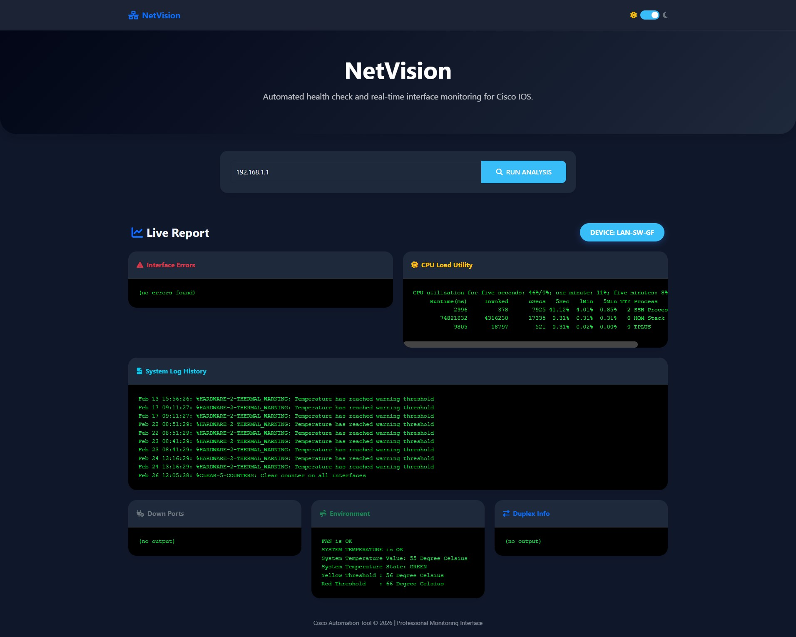

# 🛡️ NetVision
**A professional Web Dashboard for real-time Cisco IOS health monitoring & automated diagnostics.**

[](https://www.python.org)
[](https://flask.palletsprojects.com/)
[](https://opensource.org/licenses/MIT)

---

## 📖 Overview
**NetVision** is a lightweight, high-performance network automation tool designed for Network Engineers. It connects to Cisco IOS devices via SSH and provides a real-time health report through a modern, responsive dashboard.

---

## 🚀 Deployment & Usage Guide

```text
======================================================================
1. LINUX / MACOS SETUP
======================================================================
# Clone the repository
git clone [https://github.com/mucieno/NetVision.git](https://github.com/mucieno/NetVision.git) && cd NetVision

# Setup environment and install dependencies
python3 -m venv venv && source venv/bin/activate
pip install -r requirements.txt

# Create a .env file (Edit with your credentials)
echo "SSH_USERNAME=your_username" > .env
echo "SSH_PASSWORD=your_password" >> .env

# Start the application
python3 app.py


======================================================================
2. WINDOWS SETUP (PowerShell)
======================================================================
# Setup environment
python -m venv venv
.\venv\Scripts\activate

# Install and Run
pip install -r requirements.txt
python app.py


======================================================================
3. ACCESS THE DASHBOARD
======================================================================
Once the script is running, open your web browser and navigate to:

Local Access:  http://localhost:8000
Remote Access: http://your-server-ip:8000


======================================================================
4. SECURITY NOTE & BEST PRACTICES
======================================================================
- This project uses a .env file to store SSH credentials.
- NEVER commit or upload your actual .env file to GitHub.
- A .gitignore file is provided to prevent accidental credential leaks.
- Ensure SSH (VTY lines) is enabled on your Cisco devices.
======================================================================
